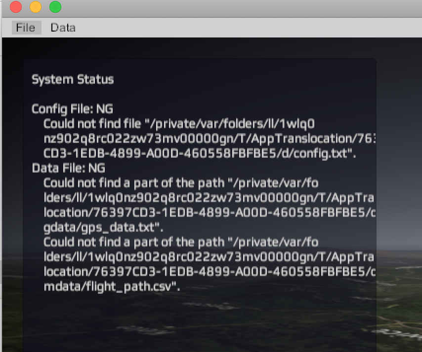
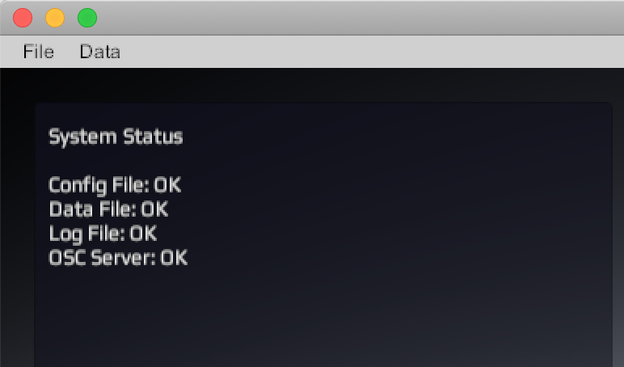

# VirtualFPV WRO2019 Biennale version

Balloon trajectory realtime visualizer, simulator, log viewer for WRO2019 BIENNALE

download link for executable file:

macOS  
https://drive.google.com/open?id=1KX_R7Dkl1aG5dv3OmMRv_rufohkl-I1S

Windows 64bit  
https://drive.google.com/open?id=1n1vLBd-sSXkleht9W2EQzZxiChX9Tgd6

## 1. macOS trouble shooting

If System Status shows 'NG' like the following image

### Step1

create a new folder

### Step2

copy vfpv_wro2019.app file into the new folder using Finder

### Step3

copy the other files/folders into the new folder using Finder

execute vfpv_wro2019.app of the new folder.

The following is OK status image:

## 2. Customize

You can customize visual by config.txt.

|keyword|value|
----|---- 
|OSCPort|OSC message receive port|
|Latitude|default latitude|
|Longitude|default longitude|

